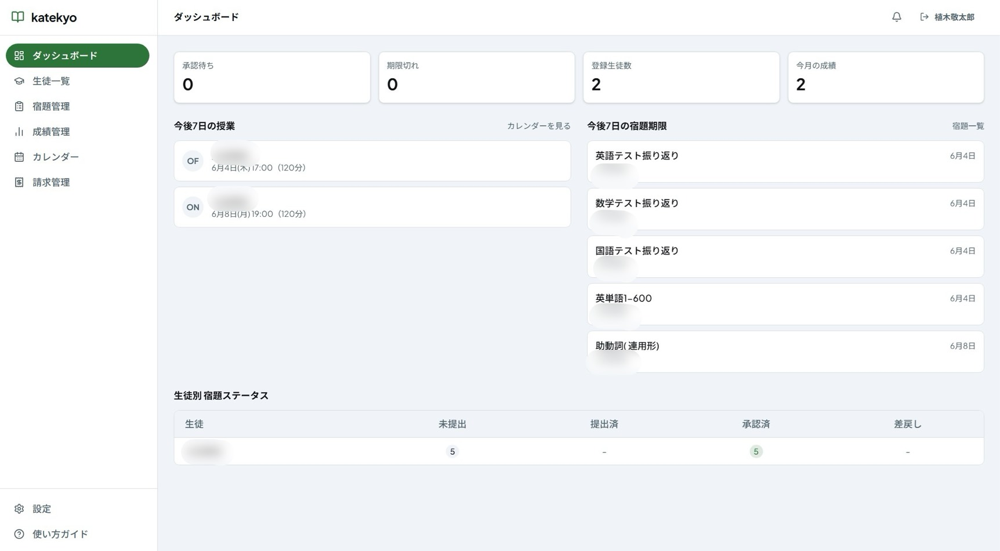
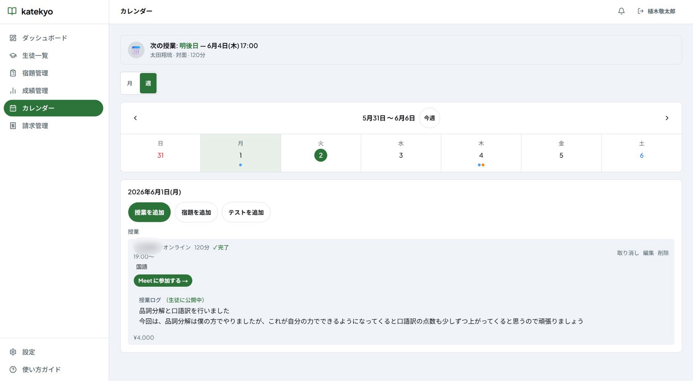
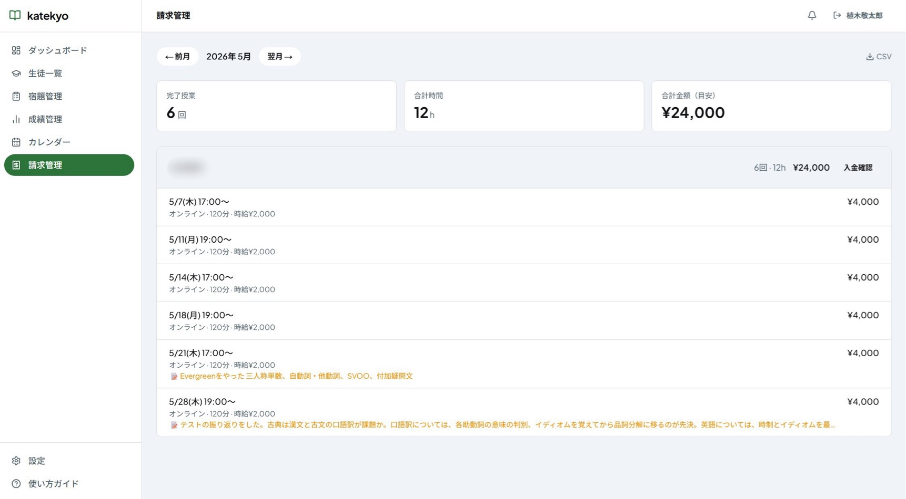
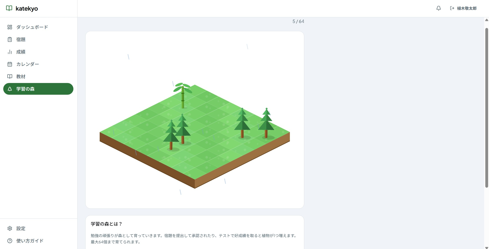

# katekyo

> 家庭教師と生徒をつなぐ、学習管理 Web アプリ

宿題の提出・承認から授業スケジュール・成績管理まで、家庭教師業務をまるごとデジタル化。LINE 通知や Google Meet 連携で、授業外のコミュニケーションもスムーズに。

本アプリケーションは、[私のポートフォリオサイト](https://97kuek.github.io/projects/katekyo/)にて解説しています。

## デモアカウント

デプロイ済みアプリ（[https://katekyo-one.vercel.app](https://katekyo-one.vercel.app)）で以下のアカウントをすぐにお試しいただけます。

| ロール | メールアドレス | パスワード |
| --- | --- | --- |
| 先生 | `97kuek.test+teacher@gmail.com` | `97kuek.test` |
| 生徒 | `97kuek.test+student@gmail.com` | `97kuek.test` |
| 保護者 | `97kuek.test+parent@gmail.com` | `97kuek.test` |

## 主な機能

### 先生アカウント

家庭教師業務の管理を一元化するメインアカウント。生徒の登録から請求管理まで、すべての操作の起点となる。

#### 宿題管理

- 宿題を作成し、生徒ごとに期限・詳細を設定
- 生徒から提出された宿題（写真添付あり）を承認 / 差し戻し
- 複数の宿題を一括承認する BulkApprove UI を実装

#### 授業カレンダー

- 対面・オンラインの授業を登録・編集・削除
- 授業完了マークをつけると請求管理に自動反映
- オンライン授業には Google Meet リンクを紐づけ可能

#### 成績管理

- テスト・模試の点数と偏差値を生徒ごとに記録
- 推移グラフで学習の伸びを可視化

#### 請求管理

- 完了済み授業の時給・交通費から月次請求額を自動計算
- 生徒別の内訳表示と入金確認をアプリ上で完結

#### LINE 通知

- 設定ページで 6 桁コードを発行 → LINE 公式アカウントに送るだけで連携完了
- 宿題提出時・毎月 1 日の授業レポートを自動受信

---

### 生徒アカウント

先生に招待されることで利用開始。宿題提出から学習記録まで、学習サイクルをアプリで完結できる。

#### ダッシュボード

- 期限切れ宿題・直近のテスト・次の授業を 1 画面にまとめて表示
- 「今日やること」が一目でわかるレイアウト

#### 宿題提出

- 提出時にノートの写真（5MB 以内）を添付可能
- 提出・承認・差し戻し・再提出のステータスを追跡

#### 学習の森

- 宿題が承認されるたびにアイソメトリックな森に植物が 1 つ育つ
- 差し戻しや期限切れで木が枯れ、再提出で回復。継続のモチベーション維持を目的に設計

#### 授業カレンダー（確認）

- 月表示・週表示で授業スケジュールを確認
- オンライン授業カードに Google Meet 参加ボタンを表示
- 授業開始 10 分前に Meet リンクを LINE へ自動送信（Upstash QStash を使用）

#### LINE 通知（生徒）

- 宿題の承認 / 差し戻し時に即時通知
- 未提出・期限切れ宿題がある場合、毎週日曜にリマインド通知

---

### 保護者アカウント

生徒から招待リンクを受け取ることで利用開始。操作権限は持たず、子どもの学習状況を閲覧するだけのシンプルな読み取り専用アカウント。

- 宿題の提出・承認状況を一覧で確認
- テスト成績と推移グラフを閲覧
- 授業スケジュールを確認

## 技術スタック

| カテゴリ | 採用技術 |
| --- | --- |
| フレームワーク | Next.js 16 (App Router) + TypeScript |
| データベース | Prisma 7 + Supabase (PostgreSQL) |
| 認証 | NextAuth.js v5 (JWT) |
| UI | shadcn/ui + Tailwind CSS v4 |
| グラフ | Recharts |
| バリデーション | Zod |
| 通知 | LINE Messaging API |
| スケジューリング | Upstash QStash |
| ストレージ | Supabase Storage |
| デプロイ | Vercel |

## ドキュメント

| ファイル | 内容 |
| --- | --- |
| [docs/architecture.md](docs/architecture.md) | ディレクトリ構成・ページ一覧・レイアウト |
| [docs/data-models.md](docs/data-models.md) | Prisma モデル全定義 |
| [docs/requirements.md](docs/requirements.md) | 機能要件・ビジネスロジック |
| [docs/api-spec.md](docs/api-spec.md) | Server Actions・Route Handlers 一覧 |
| [docs/development.md](docs/development.md) | 開発環境セットアップ・トラブルシューティング |
